# stream-learn

[](https://travis-ci.org/w4k2/stream-learn)
[](https://coveralls.io/github/w4k2/stream-learn?branch=master)
[](https://circleci.com/gh/w4k2/stream-learn/tree/master)

stream-learn is a Python package equipped with a procedures to process data streams using estimators with API compatible with scikit-learn.

## Documentation

API documentation with set of examples may be found on the [documentation page](https://w4k2.github.io/stream-learn/).

## Installation

stream-learn is available on the PyPi and you may install it with pip:

```
pip install stream-learn
```

## `StreamGenerator` class

A key element of the `stream-learn` package is a data stream generator that allows to prepare a repetitive, according to the given `random_state` value, classification dataset based on a default class distributions for the `scikit-learn` package from the `make_classification()` function. These types of distributions try to reproduce the rules for generating the `Madelon` set. The `StreamGenerator` is capable of preparing any variation of the data stream known in the general  taxonomy of data streams.


### Stationary stream
The simplest variation of data streams are *stationary streams*. They contain one basic concept, common for the whole course of the processing. Chunks differ from each other in terms of the patterns inside, but the decision boundaries of the models built on them themselves should not be different. This type of stream may be generated with a clean generator call, without any additional parameters.

```python
StreamGenerator()
```

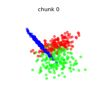

The above animation contains the scatter plot of a two-dimensional stationary stream with the problem of three classes. The `StreamGenerator` class in the initializer accepts almost all standard attributes of the `make_classification()` function, so to get exactly the distribution as above, the exact used call was:

```python
stream = StreamGenerator(
  n_classes=3,
  n_features=2,
  n_informative=2,
  n_redundant=0,
  n_repeated=0,
  n_features=2,
  n_clusters_per_class=1,
  random_state=105,
  n_chunks=100,
  chunk_size=500
)
```

What's very important, contrary to the typical call to `make_classification()`, we don't specify the `n_samples` parameter here, which determines the number of patterns in the set, but instead we provide two new attributes of data stream:

- `n_chunks` — to determine the number of chunks in a data stream,
- `chunk_size` — to dermine number of patterns in each chunk of data stream.

<!--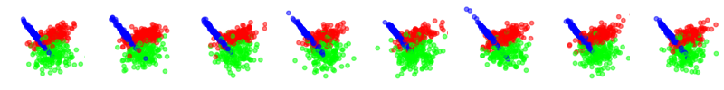-->

### Streams containing concept drifts

The most commonly studied nature of data streams is their variability in time. Responsible for this is the phenomenon of the *concept drift*, where class distributions change over time with different dynamics, which necessitates the rebuilding of already fitted classification models. The `stream-learn` package tries to meet the need to synthesize all basic variations of this phenomenon.

#### Sudden drift

```python
StreamGenerator(n_drifts=1)
```

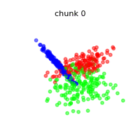
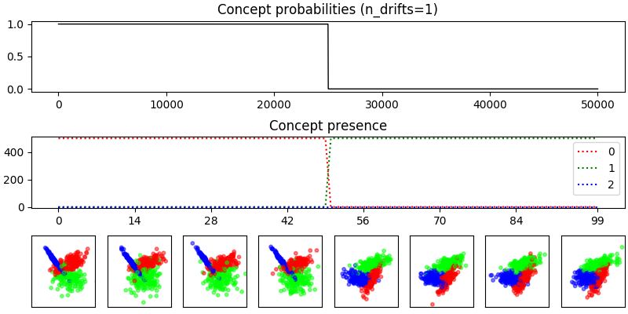

#### Incremental drift
```python
StreamGenerator(n_drifts=1, concept_sigmoid_spacing=5)
```


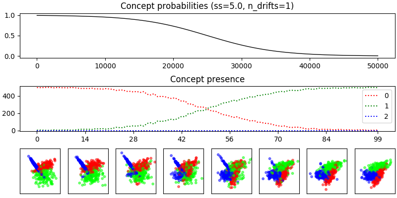


#### Gradual drift
```python
StreamGenerator(
  n_drifts=1, concept_sigmoid_spacing=5, gradual=True
)
```

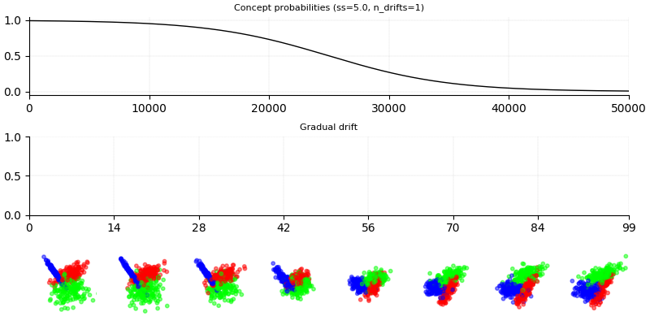

#### Reocurring drift

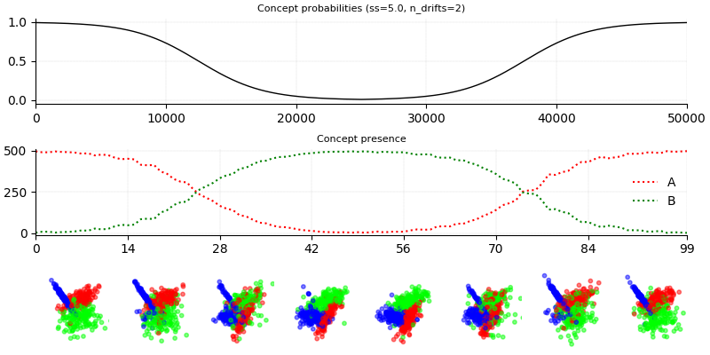

### Class imbalance

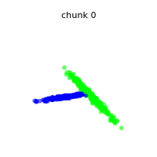
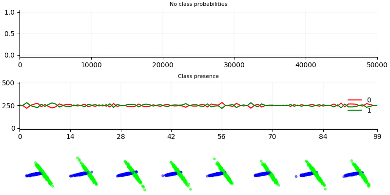

#### Stationary imbalanced stream
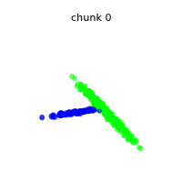
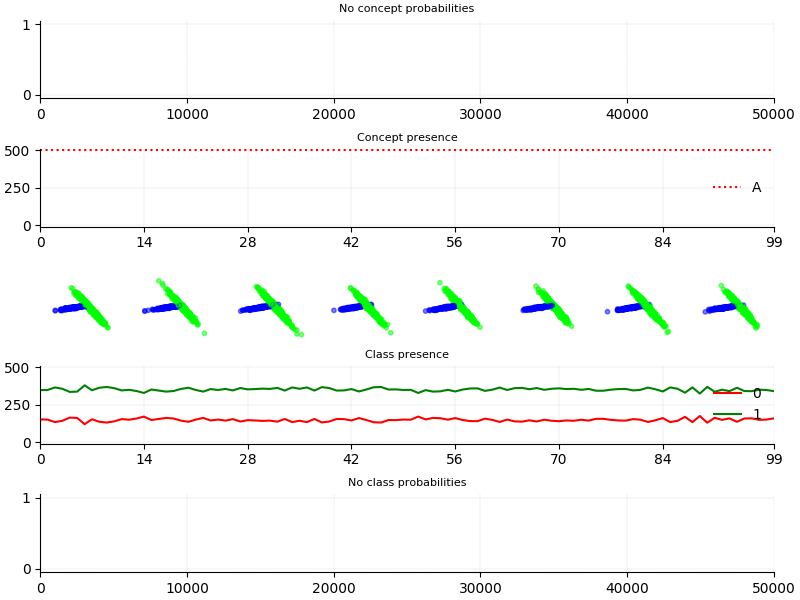

#### Dynamically imbalanced stream
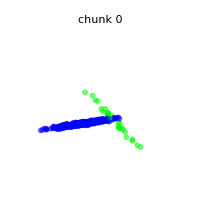
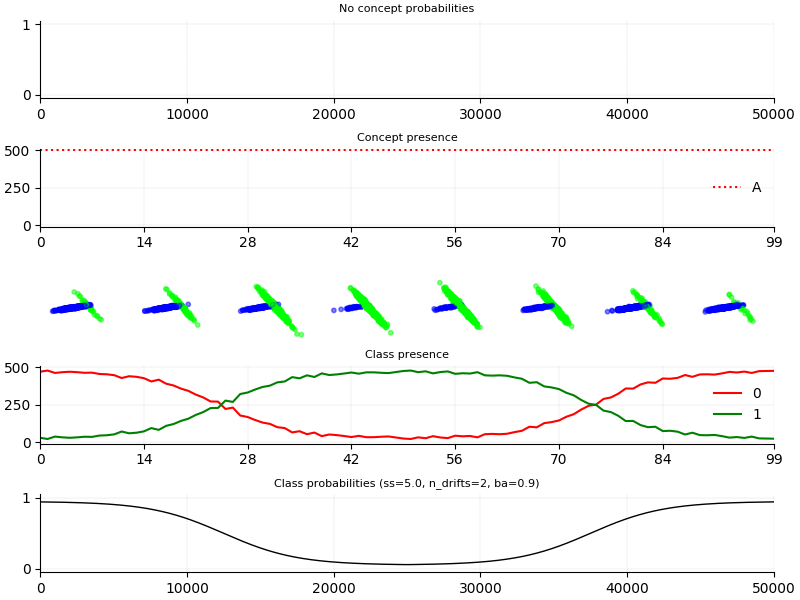

### DISCO
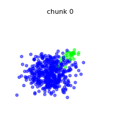
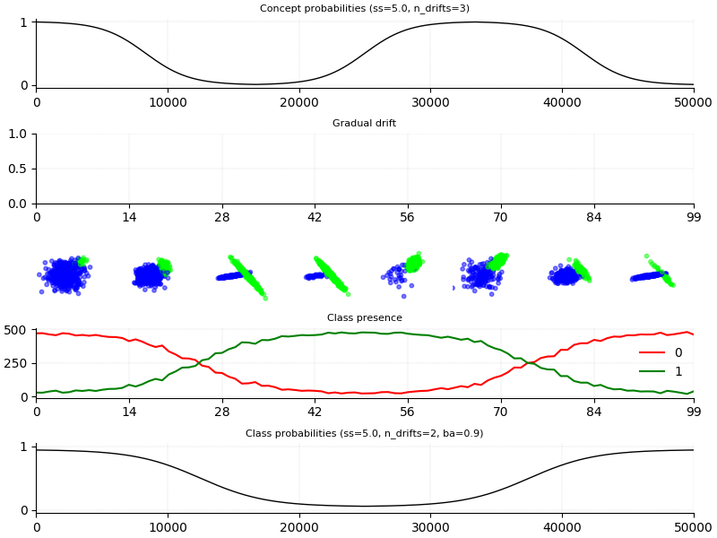

## Example usage

```python
WRONG
```

<!--
### About

If you use stream-learn in a scientific publication, we would appreciate citations to the following paper:

```
@article{key:key,
author  = {abc},
title   = {def},
journal = {ghi},
year    = {2018},
volume  = {1},
number  = {1},
pages   = {1-5},
url     = {http://jkl}
}
```
-->
