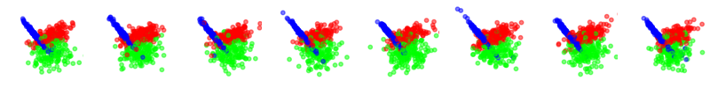
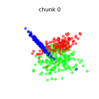
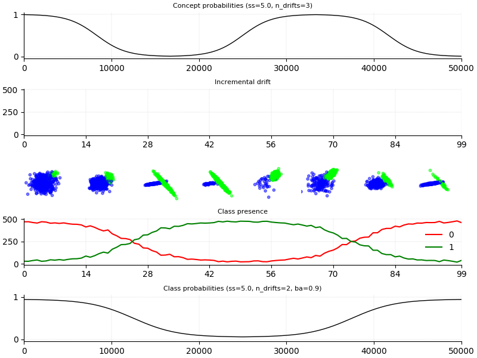

################
Stream generator
################

A key element of the `stream-learn` package is a data stream generator that allows to prepare a
repetitive, according to the given `random_state` value, classification dataset based on a default
class distributions for the `scikit-learn` package from the `make_classification()` function. These
types of distributions try to reproduce the rules for generating the `Madelon` set. The `StreamGenerator`
is capable of preparing any variation of the data stream known in the general  taxonomy of data streams.


Stationary stream
=================

The simplest variation of data streams are *stationary streams*. They contain one basic concept, common
for the whole course of the processing. Chunks differ from each other in terms of the patterns inside,
but the decision boundaries of the models built on them themselves should not be different. This type of
stream may be generated with a clean generator call, without any additional parameters.

.. code-block:: python

  StreamGenerator()

.. image:: plots/0_stationary.gif

The above animation contains the scatter plot of a two-dimensional stationary stream with the problem of
three classes. The `StreamGenerator` class in the initializer accepts almost all standard attributes of
the `make_classification()` function, so to get exactly the distribution as above, the exact used call was:

.. code-block:: python

  stream = StreamGenerator(
    n_classes=2,
    n_features=2,
    n_informative=2,
    n_redundant=0,
    n_repeated=0,
    n_features=2,
    n_clusters_per_class=1,
    random_state=105,
    n_chunks=100,
    chunk_size=500
  )

What's very important, contrary to the typical call to `make_classification()`, we don't specify the
`n_samples` parameter here, which determines the number of patterns in the set, but instead we provide
two new attributes of data stream:

- `n_chunks` — to determine the number of chunks in a data stream,
- `chunk_size` — to dermine number of patterns in each chunk of data stream.

**Not yet implemented**

Additionally, data streams may contain noise which, while not considered as concept drift,
provides additional challenge during the data stream analysis and data stream classifiers
should be robust to it. The `StreamGenerator`class implements noise by inverting the class labels
of a given percentage of incoming instances in the data stream. This percentage can be defined by
a `y_flip` parameter.




Streams containing concept drifts
=================================

The most commonly studied nature of data streams is their variability in time.
Responsible for this is the phenomenon of the *concept drift*, where class distributions
change over time with different dynamics, which necessitates the rebuilding of already
fitted classification models. The `stream-learn` package tries to meet the need to synthesize
all basic variations of this phenomenon (i.e. *sudden* (abrupt) and *gradual* drifts).

Sudden (Abrupt) drift
---------------------

This type of drift occurs when the concept from which the data stream is generated is suddenly
replaced by another one. Concept probabilities used by the `StreamGenerator`class are created based
on sigmoid function, which is generated using `concept_sigmoid_spacing` parameter, which determines
the function shape and how sudden the change of concept is. The higher the value, the more sudden the
drift. Here, this parameter takes the default value of 999, which allows us for a generation of sigmoid
function simulating an abrupt change in the data stream.

```python
StreamGenerator(n_classes=3, n_drifts=1)
```

.. image:: plots/1_sudden.png
.. image:: plots/1_sudden.gif

Gradual drift
-------------

Unlike sudden drifts, gradual ones are associated with a slower change rate, which can be noticed
during a longer observation of the data stream. This kind of drift refers to the transition phase
where the probability of getting instances from the first concept decreases while the probability
of sampling from the next concept increases. The `StreamGenerator`class simulates gradual drift by
comparing the concept probabilities with the generated random noise and, depending on the result,
selecting which concept is active at a given time.


.. code-block:: python

  StreamGenerator(
      n_classes=3, n_drifts=1, concept_sigmoid_spacing=5
  )

.. image:: plots/2_gradual.png
.. image:: plots/2_incremental.gif

Incremental (Stepwise) drift
----------------------------

The incremental drift occurs when we are dealing with a series of barely noticeable changes in
the concept used to generate the data stream. Due to this, the drift may be identified only after
some time. The severity of changes, and hence the speed of transition of one concept into another,
is described by the `concept_sigmoid_spacing` parameter.


.. code-block:: python

  StreamGenerator(
      n_classes=3, n_drifts=1, concept_sigmoid_spacing=5, incremental=True
  )


.. image:: plots/3_incremental.png
.. image:: plots/3_gradual.gif

Recurrent gradual drift
-----------------------

Situations when previous concepts reappear after some time are separately treated
and analyzed as recurrent drifts. ...


.. code-block:: python

  StreamGenerator(
      n_classes=3, n_drifts=2, concept_sigmoid_spacing=5, reocurring=True
  )

.. image:: plots/4_reocurring.png


Non-reocurring gradual drift
----------------------------


.. code-block:: python

  StreamGenerator(
      n_classes=3, n_drifts=2, concept_sigmoid_spacing=5
  )

.. image:: plots/5_nonreocurring.png
.. image:: plots/5_nonreocurring.gif

Class imbalance
===============


.. code-block:: python

  StreamGenerator()

.. image:: plots/6_balanced.png
.. image:: plots/6_balanced.gif


Stationary imbalanced stream
----------------------------


.. code-block:: python

  StreamGenerator(weights=[0.3, 0.7])

.. image:: plots/7_static_imbalanced.png
.. image:: plots/7_static_imbalanced.gif

Dynamically imbalanced stream
-----------------------------

.. code-block:: python

  StreamGenerator(weights=(2, 5, 0.9))

.. image:: plots/8_dynamic_imbalanced.png
.. image:: plots/8_dynamic_imbalanced.gif

Dynamically Imbalanced Stream with Concept Oscillation (DISCO)
==============================================================

.. code-block:: python

  StreamGenerator(
      weights=(2, 5, 0.9), n_drifts=3, concept_sigmoid_spacing=5,
      reocurring=True, incremental=True
      )



.. image:: plots/9_disco.gif
