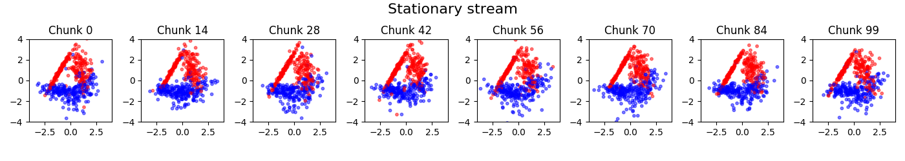
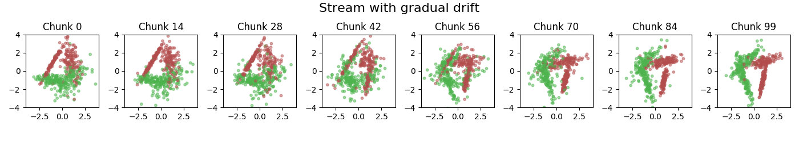
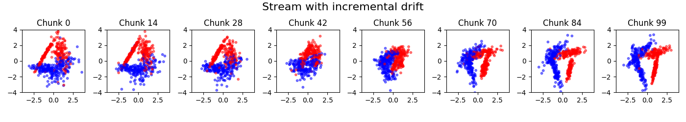
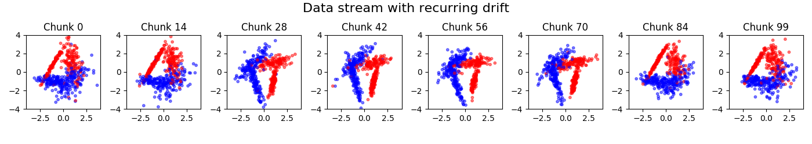
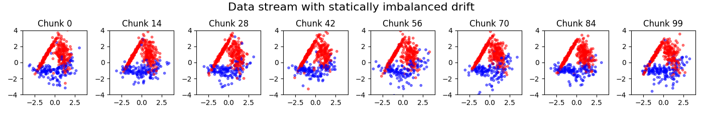
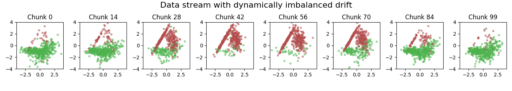
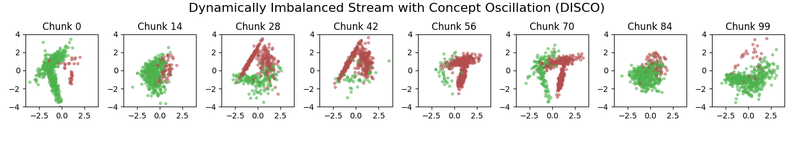

############
Data Streams
############

A key element of the ``stream-learn`` package is a generator that allows to prepare a replicable (according to the given ``random_state`` value) classification dataset with class distribution changing over the course of stream, with base concepts build on a default class distributions for the ``scikit-learn`` package from the ``make_classification()`` function. These types of distributions try to reproduce the rules for generating the ``Madelon`` set. The ``StreamGenerator`` is capable of preparing any variation of the data stream known in the general taxonomy of data streams.

Stationary stream
=================

The simplest variation of data streams are *stationary streams*. They contain one basic concept, static for the whole course of the processing. Chunks differ from each other in terms of the patterns inside, but the decision boundaries of the models built on them should not be statistically different. This type of stream may be generated with a clean generator call, without any additional parameters.

.. code-block:: python

  StreamGenerator()

The above illustration contains the series of scatter plots for a two-dimensional stationary stream with the binary problem. The ``StreamGenerator`` class in the initializer accepts almost all standard attributes of the ``make_classification()`` function, so to get exactly the distribution as above, the used call was:

.. code-block:: python

  stream = StreamGenerator(
    n_classes=2,
    n_features=2,
    n_informative=2,
    n_redundant=0,
    n_repeated=0,
    n_features=2,
    random_state=105,
    n_chunks=100,
    chunk_size=500
  )

What's very important, contrary to the typical call to ``make_classification()``, we don't specify the
``n_samples`` parameter here, which determines the number of patterns in the set, but instead we provide
two new attributes of data stream:

- ``n_chunks`` — to determine the number of chunks in a data stream.
- ``chunk_size`` — to determine the number of patterns in each data chunk.

Additionally, data streams may contain noise which, while not considered as concept drift, provides additional challenge during the data stream analysis and data stream classifiers should be robust to it. The ``StreamGenerator`` class implements noise by inverting the class labels of a given percentage of incoming instances in the data stream. This percentage can be defined by a ``y_flip`` parameter, like in standard ``make_classification()`` call. If a single float is given as the parameter value, the percentage of noise refers to combined instances from all classes, while if we specify a tuple of floats, the noise occurs within each class separately using the given percentages.

Streams containing concept drifts
=================================

The most commonly studied nature of data streams is their variability in time. Responsible for this is the phenomenon of the *concept drift*, where class distributions change over time with different dynamics, which necessitates the rebuilding of already
fitted classification models. The ``stream-learn`` package tries to meet the need to synthesize all basic variations of this phenomenon (i.e. *sudden* (abrupt) and *gradual* drifts).

Sudden (Abrupt) drift
---------------------

This type of drift occurs when the concept from which the data stream is generated is suddenly replaced by another one. Concept probabilities used by the ``StreamGenerator`` class are created based on sigmoid function, which is generated using ``concept_sigmoid_spacing`` parameter, which determines the function shape and how sudden the change of concept is. The higher the value, the more sudden the drift becames. Here, this parameter takes the default value of 999, which allows us for a generation of sigmoid function simulating an abrupt change in the data stream.

.. code-block:: python

  StreamGenerator(n_drifts=1)

.. image:: _static/sudden.png

Gradual drift
-------------

Unlike sudden drifts, gradual ones are associated with a slower change rate, which can be noticed during a longer observation of the data stream. This kind of drift refers to the transition phase
where the probability of getting instances from the first concept decreases while the probability of sampling from the next concept increases. The ``StreamGenerator`` class simulates gradual drift by
comparing the concept probabilities with the generated random noise and, depending on the result, selecting which concept is active at a given time.

.. code-block:: python

  StreamGenerator(
      n_drifts=1, concept_sigmoid_spacing=5
  )

Incremental (Stepwise) drift
----------------------------

The incremental drift occurs when we are dealing with a series of barely noticeable changes in the concept used to generate the data stream, in opposite of gradual drift, where we are mixing samples from different concepts without changing them. Due to this, the drift may be identified only after some time. The severity of changes, and hence the speed of transition of one concept into another, is, like in previous example, described by the `concept_sigmoid_spacing` parameter.

.. code-block:: python

  StreamGenerator(
      n_drifts=1, concept_sigmoid_spacing=5, incremental=True
  )

Recurrent drift
-----------------------

The cyclic repetition of class distributions is a completely different property of concept drifts. If after another drift, the concept earlier present in the stream returns, we are dealing with a *recurrent drift*. We can get this kind of data stream by setting the ``recurring`` flag in the generator.

.. code-block:: python

  StreamGenerator(
      n_drifts=2, recurring=True
  )

Non-recurring drift
---------------------------

The default mode of consecutive concept occurences is a non-recurring drift, where in each concept drift we are generating a completely new, previously unseen  class distribution.

.. code-block:: python

  StreamGenerator(
      n_drifts=2
  )

.. image:: _static/nonrecurring.png

Class imbalance
===============

Another area of data stream properties, different from the concept drift phenomenon, is the prior probability of problem classes. By default, a balanced stream is generated, i.e. one in which patterns of all classes are present in a similar number.

.. code-block:: python

  StreamGenerator()

Stationary imbalanced stream
----------------------------

The basic type of problem in which we are dealing with disturbed class distribution is a *dataset imbalanced stationary*, where the classes maintain a predetermined proportion in each chunk of data stream. To acquire this type of a stream, one should pass the ``list`` to the ``weights`` parameter of the generator (i) consisting of as many elements as the classes in the problem and (ii) adding to one.

.. code-block:: python

  StreamGenerator(weights=[0.3, 0.7])

Dynamically imbalanced stream
-----------------------------

A less common type of *imbalanced data*, impossible to obtain in static datasets, is *data imbalanced dynamically*. In this case, the class distribution is not constant throughout the course of a stream, but changes over time, similar to changing the concept presence in gradual streams. To get this type of data stream, we pass a ``tuple`` of three numeric values to the ``weights`` parameter of the generator:

- the number of cycles of distribution changes,
- ``concept_sigmoid_spacing`` parameter, deciding about the dynamics of changes on the same principle as in gradual and incremental drifts,
- range within which oscillation is to take place.

.. code-block:: python

  StreamGenerator(weights=(2, 5, 0.9))

Mixing drift properties
=======================

Of course, when generating data streams, we don't have to limit ourselves to just one modification of their properties. We can easily prepare a stream with many drifts, any dynamics of changes, a selected type of drift and a diverse, dynamic imbalanced ratio. The last example in this chapter of User Guide is such proposition, namely, DISCO (Dynamically Imbalanced Stream with Concept Oscillation).

.. code-block:: python

  StreamGenerator(
      weights=(2, 5, 0.9), n_drifts=3, concept_sigmoid_spacing=5,
      recurring=True, incremental=True
  )

