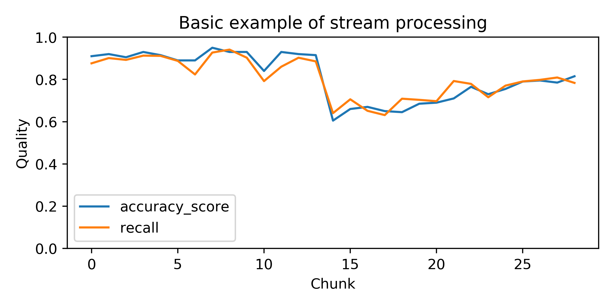

#################
Quick start guide
#################

Installation
------------

To use the `stream-learn` package, it will be absolutely useful to install it. Fortunately, it is available in the PyPI repository, so you may install it using `pip`::

  pip install -U stream-learn

You can also install the module cloned from Github using the setup.py file if you have a strange, but perhaps legitimate need::

  git clone https://github.com/w4k2/stream-learn.git
  cd stream-learn
  make install

Preparing experiments
---------------------

In order to conduct experiments, a declaration of four elements is necessary. The first is the estimator, which must be compatible with the ``scikit-learn`` API and, in addition, implement the ``partial_fit()`` method, allowing you to re-fit the already built model. For example, we'll use the standard *Gaussian Naive Bayes* algorithm::

  from sklearn.naive_bayes import GaussianNB
  clf = GaussianNB()

The next element is the data stream that we aim to process. In the example we will use a synthetic stream consisting of shocking number of 30 chunks and containing precisely one concept drift. We will prepare it using the ``StreamGenerator`` class of the ``stream-learn`` module::

  from strlearn.streams import StreamGenerator
  stream = StreamGenerator(n_chunks=30, n_drifts=1)

The third requirement of the experiment is to specify the metrics used in the evaluation of the methods. In the example, we will use the *accuracy* metric available in ``scikit-learn`` and the *balanced accuracy* from the ``stream-learn`` module::

  from sklearn.metrics import accuracy_score
  from strlearn.metrics import balanced_accuracy_score
  metrics = [accuracy_score, balanced_accuracy_score]

The last necessary element of processing is the evaluator, i.e. the method of conducting the experiment. For example, we will choose the *Test-Then-Train* paradigm, described in more detail in `User Guide <evaluators.html>`_. It is important to note, that we need to provide the metrics that we will use in processing at the point of initializing the evaluator. In the case of none metrics given, it will use default pair of *accuracy* and *balanced accuracy* scores::

  from strlearn.evaluators import TestThenTrain
  evaluator = TestThenTrain(metrics)

Processing and understanding results
------------------------------------

Once all processing requirements have been met, we can proceed with the evaluation. To start processing, call the evaluator's process method, feeding it with the stream and classifier::

  evaluator.process(stream, clf)

The results obtained are stored in the ``scores`` atribute of evaluator. If we print it on the screen, we may be able to observe that it is a three-dimensional numpy array with dimensions ``(1, 29, 2)``.

- The first dimension is the **index of a classifier** submitted for processing. In the example above, we used only one model, but it is also possible to pass a tuple or list of classifiers that will be processed in parallel (See `User guide:evaluators <evaluators.html>`_).
- The second dimension specifies the **instance of evaluation**, which in the case of *Test-Then-Train* methodology directly means the index of the processed chunk.
- The third dimension indicates the **metric** used in the processing.

Using this knowledge, we may finally try to illustrate the results of our simple experiment in the form of a plot::

  import matplotlib.pyplot as plt

  plt.figure(figsize=(6,3))

  for m, metric in enumerate(metrics):
      plt.plot(evaluator.scores[0, :, m], label=metric.__name__)

  plt.title("Basic example of stream processing")
  plt.ylim(0, 1)
  plt.ylabel('Quality')
  plt.xlabel('Chunk')

  plt.legend()

